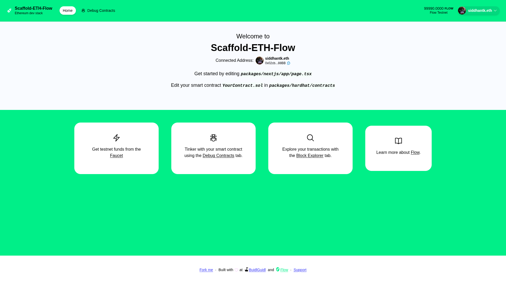

# 🏗 Scaffold-ETH-Flow

<div align="center">

</div>

<h4 align="center">
  <a href="https://developers.flow.com/">Flow Documentation</a>
  | <a href="https://github.com/siddhant-k08/scaffold-eth-flow/issues">Report Issue</a>
</h4>

⚙️ Built using NextJS, RainbowKit, Hardhat, Wagmi, Viem, and Typescript.

-   ✅ **Contract Hot Reload**: Your frontend auto-adapts to your smart contract as you edit it.
-   🪝 **[Custom hooks](https://docs.scaffoldeth.io/hooks/)**: Collection of React hooks wrapper around [wagmi](https://wagmi.sh/) to simplify interactions with smart contracts with typescript autocompletion.
-   🧱 [**Components**](https://docs.scaffoldeth.io/components/): Collection of common web3 components to quickly build your frontend.
-   🔥 **Burner Wallet & Local Faucet**: Quickly test your application with a burner wallet and local faucet.
-   🔐 **Integration with Wallet Providers**: Connect to different wallet providers and interact with the Flow network.



## Requirements

Before you begin, you need to install the following tools:

-   [Node (>= v18.18)](https://nodejs.org/en/download/)
-   Yarn ([v1](https://classic.yarnpkg.com/en/docs/install/) or [v2+](https://yarnpkg.com/getting-started/install))
-   [Git](https://git-scm.com/downloads)

## Quickstart

To get started, follow the steps below:

1. Clone this repo & install dependencies
 
```sh
git clone https://github.com/siddhant-k08/scaffold-eth-flow.git
```

2. Open the project directory and install dependencies

```sh
cd scaffold-eth-flow && yarn install
```

3. Setup `.env` file for Hardhat:

Make a copy of `.env.example` in `packages/hardhat` folder, name it `.env` and enter the respective values

```
DEPLOYER_PRIVATE_KEY=
```

4. Deploying smart contracts on Flow:

Once the `.env` file is setup, you can now run the below command in your terminal.

```sh
yarn deploy
```

This command deploys a test smart contract to the Flow testnet network. The contract is located in `packages/hardhat/contracts` and can be modified to suit your needs. The `yarn deploy` command uses the deploy script located in `packages/hardhat/deploy` to deploy the contract to the network. You can also customize the deploy script.


5. On a second terminal, start your NextJS app:

```
yarn start
```

Visit your app on: `http://localhost:3000`. You can interact with your smart contract using the `Debug Contracts` page. You can tweak the app config in `packages/nextjs/scaffold.config.ts`.

**What's next**:

-   Edit your smart contract `YourContract.sol` in `packages/hardhat/contracts`
-   Edit your frontend homepage at `packages/nextjs/app/page.tsx`. For guidance on [routing](https://nextjs.org/docs/app/building-your-application/routing/defining-routes) and configuring [pages/layouts](https://nextjs.org/docs/app/building-your-application/routing/pages-and-layouts) checkout the Next.js documentation.
-   Edit your deployment scripts in `packages/hardhat/deploy`
-   Edit your smart contract test in: `packages/hardhat/test`. To run test use `yarn hardhat:test`

## Flow Network Configuration

This scaffold is configured for Flow Testnet by default. Here are the network details:

- **Network Name**: Flow Testnet
- **Chain ID**: 545
- **Currency**: FLOW (Flow Token)
- **RPC URL**: `https://testnet.evm.nodes.onflow.org`
- **Explorer**: `https://testnet.flowscan.io`

### Getting Flow Testnet FLOW

You can get testnet FLOW from the [Flow Faucet](https://faucet.flow.com/fund-account).

## Documentation

Visit our [Flow docs](https://developers.flow.com) to learn how to start building with Flow.

To know more about Scaffold-ETH features, check out their [website](https://scaffoldeth.io).
